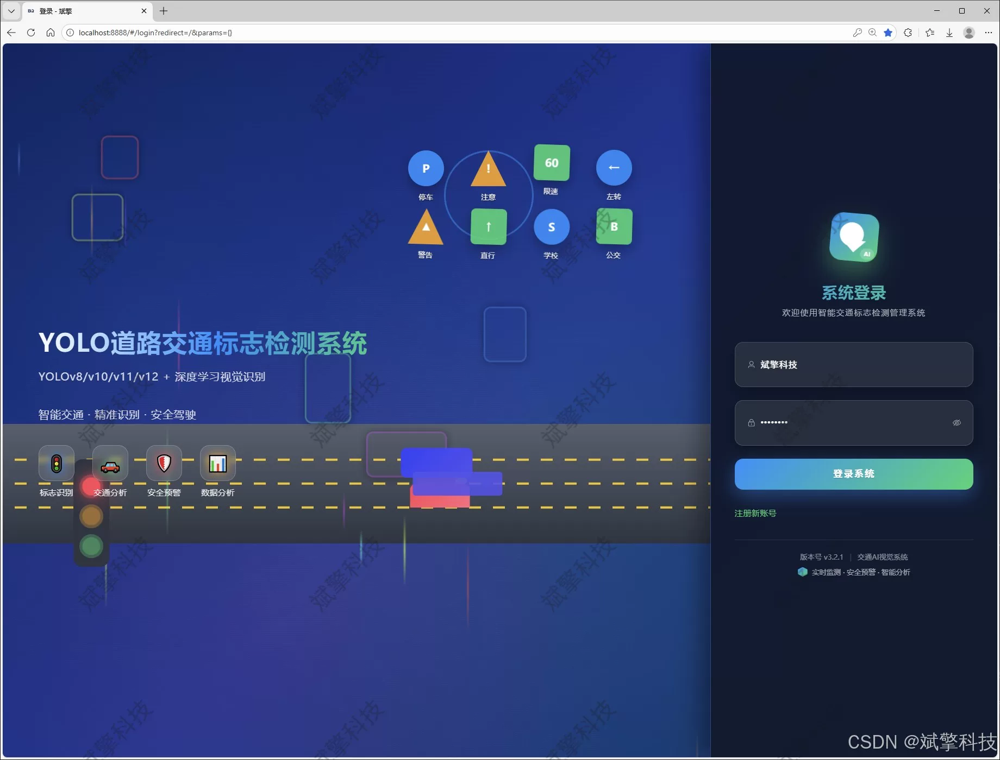
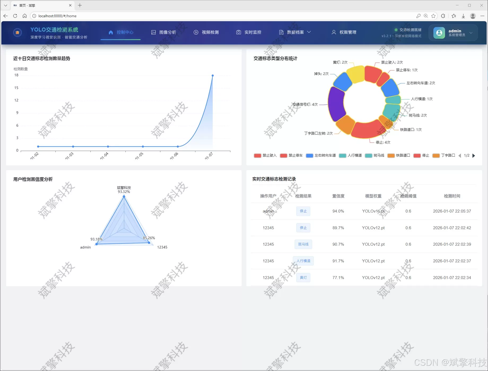
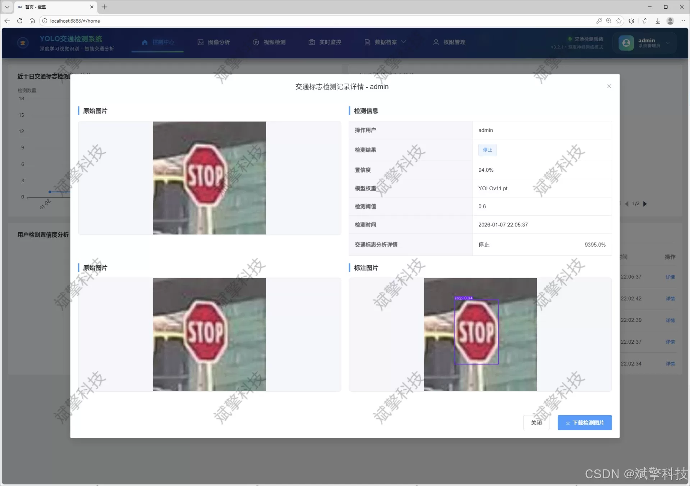
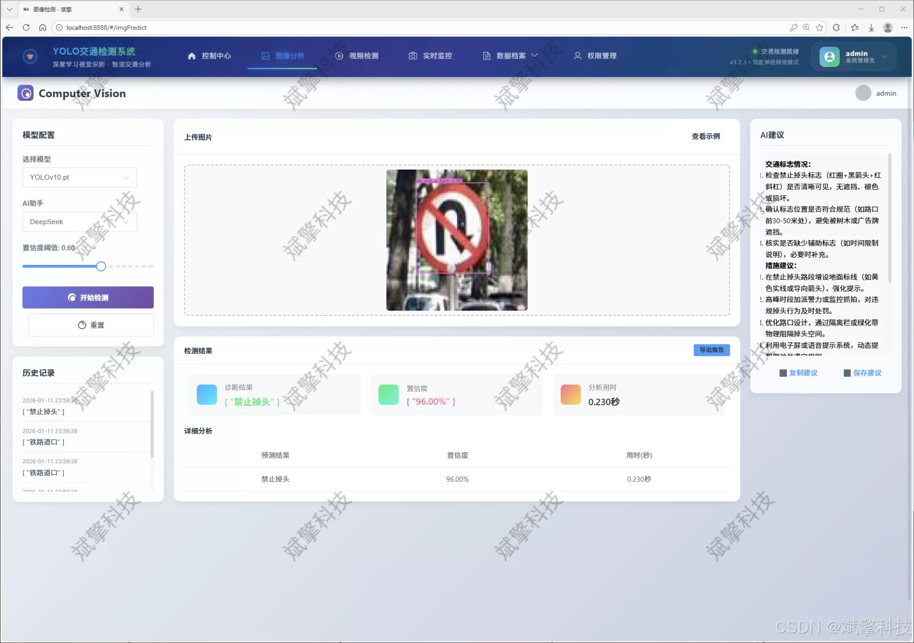
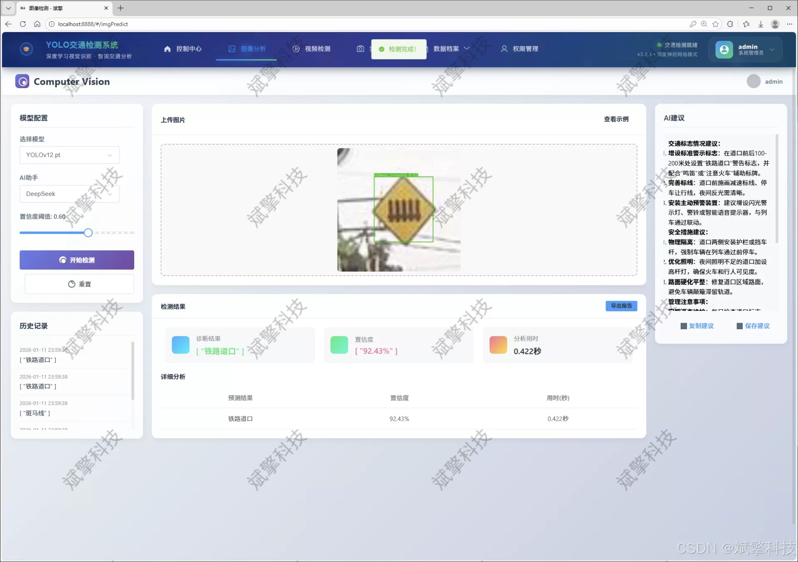
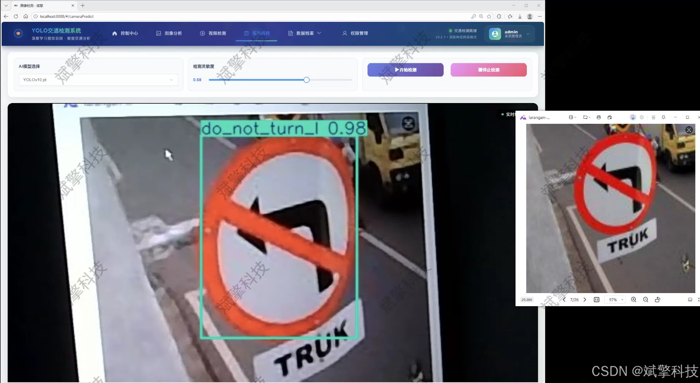
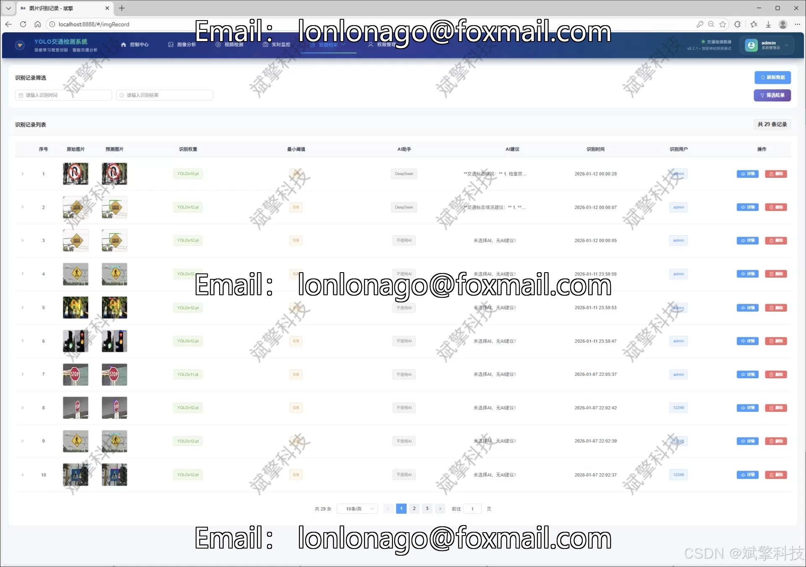
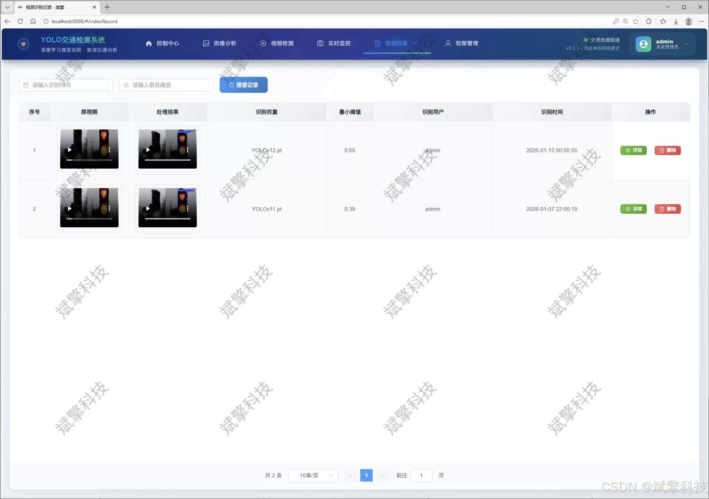
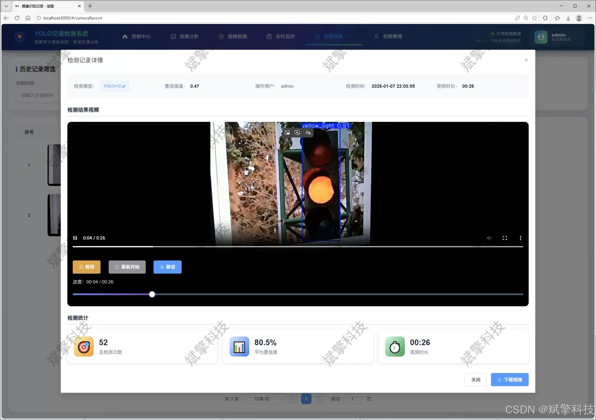

# YOLO for Traffic Signal Detection

## Body

YOLO Traffic Sign Recognition System Based on YOLO Deep Learning and the Large Models of Qianwen and DeepSeek for Road Traffic Sign Detection (DeepSeek Intelligent Analysis + web interaction interface + front-end and back-end separation + YOLO data + YOLOv8/YOLOv10/YOLOv11/YOLOv12)

With the rapid development of intelligent transportation systems and autonomous driving technology, real-time and accurate detection of traffic signal signs in road scenes has become a crucial core technology. This study aims to design and implement an intelligent traffic signal sign detection and analysis system that integrates advanced target detection algorithms with modern Web application architecture.

The system adopts the "front-end and back-end separation" design pattern, with the backend built on the SpringBoot framework to create high-performance, scalable services. The front end provides a user-friendly Web interaction interface. The core detection module innovatively integrates and supports four iterations of the YOLO series models (YOLOv8, YOLOv10, YOLOv11, YOLOv12), allowing users to flexibly switch and compare performance based on different speed and precision needs. For a custom dataset covering 21 common traffic signs (such as 'stop', 'traffic_light', 'ped_crossing' etc.), the system conducted detailed model training and evaluation.

In addition to basic multimedia detection functions such as images, videos, and real-time camera streams, the system's distinctive innovation lies in the introduction of DeepSeek's intelligent analysis capabilities. This allows for semantic interpretation of detection results, contextual reasoning, and the generation of safety driving recommendations, significantly enhancing the system's level of intelligence. All user operations, detection records, and outcomes are persistently stored in a MySQL database, complemented by rich data visualization charts for easy analysis and traceability. The system also implements a comprehensive user permission management module, including login registration, personal center, and an administrator backend, ensuring the system's security and practicality.

Functional module

✅ User Login and Registration: Supports password detection, saves to MySQL database.

✅ Supports four YOLO model switches, YOLOv8, YOLOv10, YOLOv11, YOLOv12.

✅ Information Visualization, Data Visualization.

✅ Image detection supports AI analysis functions, deepseek and Qianwen.

✅ Supports image detection, video detection, and real-time camera detection. The results are saved to a MySQL database.

✅ Picture recognition record management, video recognition record management and camera recognition record management.

✅ User Management Module, administrators can add, delete, modify, and query users.

✅ Personal center, can modify their own information, password name profile picture and so on.

There is no Lunwen writing service, nor any Lunwen.

## Images

## Payment

Here is a pay link on Stripe ( https://buy.stripe.com/3cs8yP7sY87d0vu9AB ). Please contact me lonlonago@foxmail.com after funding $89, and I will send you a complete data files , thank you!

